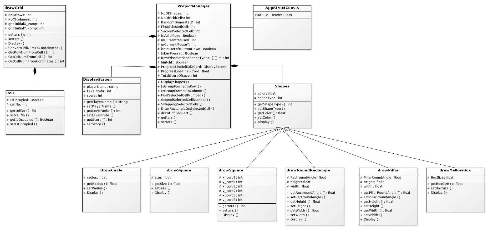

# CandyCrush_Game
A C++ implementation of the popular Candy Crush game using object-oriented programming &amp; SFML library for graphics. Matches candies to score, swap adjacent candies. Game ends when score reaches a certain level or out of moves. User input via mouse clicks. No saved progress.

## Running the program
To run the program, navigate to the project directory in a terminal and run:

- g++ game.cpp -o candycrush
- ./candycrush

## Class Diagram
 
## Gameplay
- The player matches three or more candies of the same color to score points and progress through levels.
- The player can swap adjacent candies to make matches.
- The game ends when the player reaches a certain score or runs out of moves.

## Features
- The program uses the SFML library to display the game graphics.
- The program implements object-oriented concepts such as inheritance, polymorphism, and encapsulation.
- The program includes sound effects and a graphical user interface.

## Input
- The program takes user input via mouse clicks to select and swap candies.

## Output
- The program outputs the game board and score after each move.

## Note
- The program does not save the player's progress, so it has to be restarted from the beginning each time it is played.

